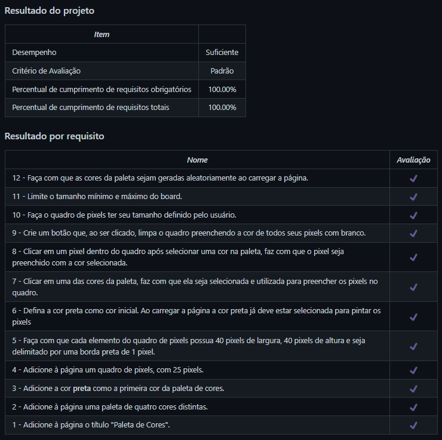

# Pixels Art
Projeto da [Trybe](https://www.betrybe.com/) - Bloco 5 - Aplicação para construção de imagens com pixels coloridos feita com HTML, CSS e Javascript.

## 💻 Projeto

Aplicação que contém uma paleta de cores funcional para criação de desenhos em pixels feita com HTML, CSS e Javascript.

<details>
  <summary><strong>🏆 Meu desempenho</strong></summary><br />

  
</details>

## 🚀 Tecnologias
> Este projeto foi desenvolvido com as seguintes tecnologias:

- HTML
- CSS
- JavaScript

## 📌 Habilidades
> Neste projeto, desenvolvi as seguintes habilidades:

- Manipular o DOM;
- Manipular o JavaScript.

## ⬇️ Instalando dependências

```bash
npm install
``` 

## 💬 Contatos

<div align="center" style="display: inline_block">
  <a href="https://julianoboese.github.io" target="_blank"></a> 
  <a href="https://www.linkedin.com/in/julianoboese" target="_blank"></a> 
  <a href = "mailto:juliano.boese@gmail.com"></a>
</div>

<!-- ## 📄 Licença

Esse projeto está sob licença. Veja o arquivo [LICENÇA](LICENSE.md) para mais detalhes.

[⬆ Voltar ao topo](#nome-do-projeto)<br> -->
